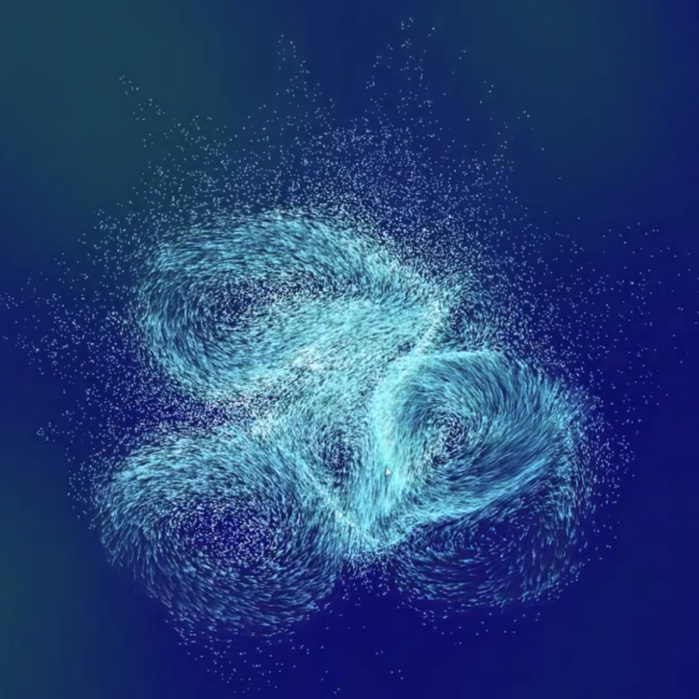
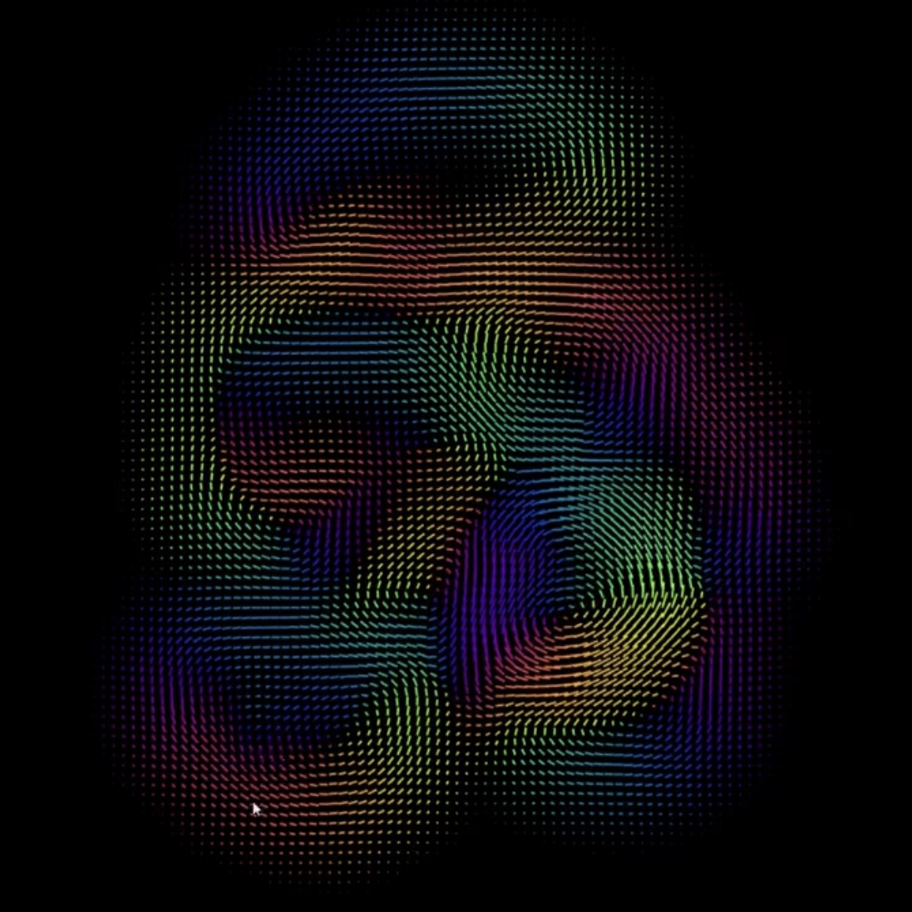
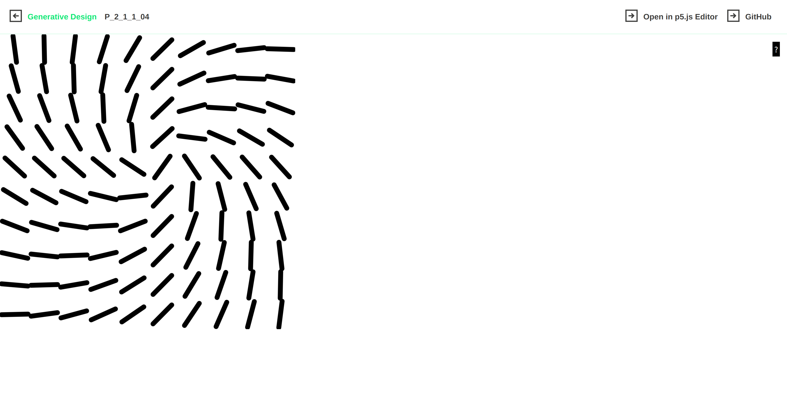

# Quiz 8 – Design Research for Final Project

## Part 1: Imaging Technique Inspiration
  

I was inspired by fluid, organic motion patterns seen in flow field visualizations and generative particle artworks. These visuals show strong directionality and elegant systemic movement, which relate well to the multitude of lines in my final project respond to the mouse. My aim is to incorporate a similar sense of coordinated direction and structure within the original paintings. The interaction will feel like a swarm or vector field aligning toward a common point.

## Part 2: Coding Technique Exploration

[View Code Example on GitHub](https://github.com/generative-design/Code-Package-p5.js/blob/master/01_P/P_2_1_1_04/sketch.js)

It calculates the angle between each grid point and the mouse, and uses `atan2()` to rotate each shape accordingly. This creates a strong directional flow, similar to a visual force field. Additionally, the size of each angle can change depending on distance from the mouse, enhancing the sense of depth and attraction. This technique directly supports my concept of simulating fluid, systemic motion driven by user input. I plan to build on this behavior by possibly introducing visual enhancements such as:
 changing color by distance,
 incorporating fade-in/fade-out effects,
 or having the shapes respond to mouse speed.

## Source

